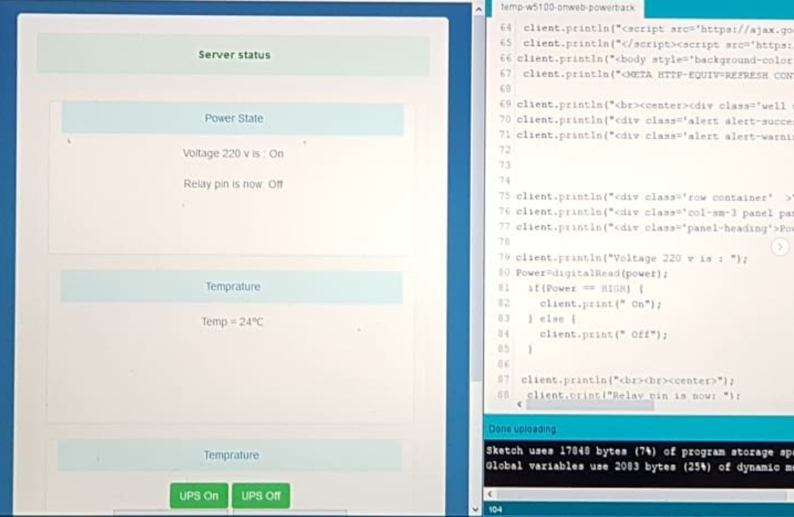

**Statino**

Statino is a small ESP8266 (Wemos/NodeMCU) project that collects sensor or device values and sends them to a configured IP address on your local network. This repository contains the Arduino sketch `Statinov_0.1.ino` and a simple example image `wemos.PNG`.

**Features**

- **Collects Data**: Reads sensor or device values from an ESP8266 board.
- **Local Forwarding**: Sends collected values to a configured IP address (e.g., a local server or another device).
- **Simple Sketch**: Single Arduino sketch (`Statinov_0.1.ino`) — easy to modify for your sensors.

**Hardware**

- **Board**: Wemos D1 Mini, NodeMCU, or other ESP8266-based boards.
- **Power**: USB or external 5V supply (ensure correct wiring for sensors).
- **Sensors**: Any sensors supported by ESP8266 (DHT, DS18B20, analog sensors on ADC, etc.).

**Wiring**

- **Power**: Connect 5V (or Vin) and GND to your board.
- **Data**: Connect sensors to appropriate GPIO pins. Check sensor datasheets for correct pull-ups and wiring.

**Getting Started**

- **Arduino IDE**:
  - Install the ESP8266 Board package in the Arduino Boards Manager.
  - Open the sketch `Statinov_0.1.ino` in the Arduino IDE.
  - Edit the configuration section in the top of the sketch (Wi-Fi SSID, password, target IP/port).
  - Select the correct board and COM port, then click `Upload`.
- **PlatformIO (VS Code)**:
  - Create a PlatformIO project for your ESP8266 board.
  - Add the sketch or convert it to a `src` file and set the environment in `platformio.ini`.
  - Build and upload with: `pio run -t upload`.

**Configuration**

- **Wi-Fi**: Update the `ssid` and `password` variables in the sketch to match your network.
- **Target**: Update the `targetIP` and `targetPort` (or equivalent) variables to the IP address and port that should receive the data.
- **Polling / Interval**: Adjust sampling intervals in the sketch as needed.

**Usage**

- Power the board and open the Serial Monitor (`115200` baud is common) to observe boot messages and any debug output.
- Ensure the target IP is listening for incoming data — this sketch forwards values to that address.

**Files**

- `Statinov_0.1.ino`: Main Arduino sketch (edit to configure Wi-Fi and target IP).
- `wemos.PNG`: Photo of the Wemos used for reference.
- `LICENSE`: Project license (MIT).

**Contributing**

- Feel free to open issues or pull requests. Describe changes clearly and keep commits focused.
- If you add sensor support, include wiring notes and example values.

**License**
This project is released under the MIT License — see the [LICENSE](LICENSE) file in this repository for the full text.

**Acknowledgements**

- Thanks to contributors and those who share improvements for Arduino and ESP8266 projects.
